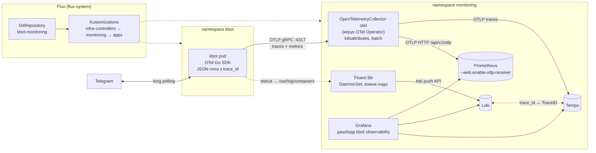
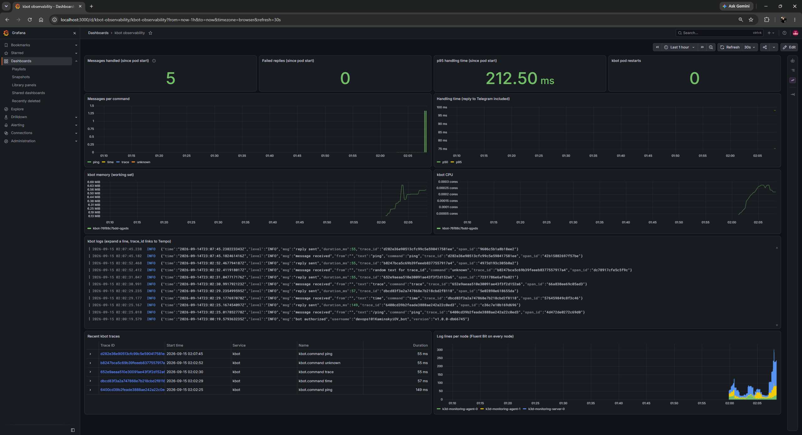

# kbot-monitoring

Моніторинговий стек для [kbot](https://github.com/Alexander-2212/kbot) (гілка `develop`),
розгорнутий у Kubernetes через **Flux** (GitOps). Рівень виконання - **principal**:
kbot експортує метрики й трейси через OpenTelemetry, а один і той самий **TraceID**
наскрізно зв'язує трейс у Tempo з логами в Loki.

| Компонент | Роль |
|---|---|
| **OpenTelemetry Operator** | керує `OpenTelemetryCollector` (CR) - колектор приймає OTLP від kbot |
| **Prometheus** | метрики: kbot (через OTLP receiver), kube-state-metrics, node-exporter, cAdvisor |
| **Fluent Bit** | DaemonSet на **всіх нодах**: збирає логи всіх контейнерів кластера й відправляє в Loki |
| **Grafana Loki** | зберігання та пошук логів |
| **Grafana Tempo** | зберігання трейсів |
| **Grafana** | datasources і дашборд `kbot observability` провізіонуються з Git |

## Схема



## Наскрізний TraceID

1. Кожне повідомлення в kbot обробляється як трейс: кореневий span `kbot.command <команда>`
   та дочірній span `telegram sendMessage` (відповідь у Telegram API).
2. Логер kbot (`log/slog`, JSON) бере активний span із контексту й додає до кожного
   рядка `trace_id` і `span_id` ([`cmd/log.go`](https://github.com/Alexander-2212/kbot/blob/develop/cmd/log.go)).
3. Трейси й метрики йдуть по OTLP в колектор, звідти в Tempo і Prometheus. Логи йдуть окремим
   шляхом: Fluent Bit читає stdout контейнера, `Merge_Log On` розбирає JSON, запис потрапляє в Loki.
4. У Grafana:
   - **лог → трейс**: derived field `TraceID` у datasource Loki (regex `"trace_id":"(\w+)"`)
     перетворює значення на посилання, яке відкриває цей трейс у Tempo;
   - **трейс → логи**: `tracesToLogsV2` у datasource Tempo - кнопка "Logs for this span"
     шукає в Loki `{namespace="kbot"} |= "<TraceID>"`.
5. Команда бота `/trace` повертає TraceID поточного запиту - його можна вставити в пошук Tempo.

```json
{"time":"...","level":"INFO","msg":"message received","from":"...","text":"/ping","command":"ping","trace_id":"4bf92f3577b34da6a3ce929d0e0e4736","span_id":"00f067aa0ba902b7"}
```

## Інструментація kbot

Код у репозиторії kbot, гілка `develop`:

| Файл | Що робить |
|---|---|
| [`cmd/telemetry.go`](https://github.com/Alexander-2212/kbot/blob/develop/cmd/telemetry.go) | TracerProvider і MeterProvider з OTLP/gRPC експортерами, ресурс `service.name=kbot`, `service.version`, атрибути з `OTEL_RESOURCE_ATTRIBUTES` |
| [`cmd/log.go`](https://github.com/Alexander-2212/kbot/blob/develop/cmd/log.go) | `slog`-handler, що додає `trace_id`/`span_id` |
| [`cmd/start.go`](https://github.com/Alexander-2212/kbot/blob/develop/cmd/start.go) | спани на кожне повідомлення, метрики, коректне завершення з flush телеметрії по SIGTERM |
| [`helm/templates/deployment.yaml`](https://github.com/Alexander-2212/kbot/blob/develop/helm/templates/deployment.yaml) | змінні `OTEL_*` та атрибути пода (downward API), якщо задано `otel.endpoint` |

Метрики в Prometheus:

| Метрика | Тип | Мітки |
|---|---|---|
| `kbot_commands_total` | counter | `command` (фіксований набір, `unknown` для решти), `status` (`ok`/`error`) |
| `kbot_command_duration_seconds` | histogram | `command`, `status` |

Без `OTEL_EXPORTER_OTLP_ENDPOINT` експорт вимкнено, бот працює локально як і раніше.

## Структура репозиторію

```
clusters/k3d-monitoring/
  flux-system/            # flux bootstrap
  infrastructure.yaml     # Kustomizations infra-controllers -> monitoring (dependsOn, wait)
  apps.yaml               # Kustomization apps (dependsOn monitoring)
infrastructure/
  controllers/            # namespaces, HelmRepositories, OpenTelemetry Operator
  monitoring/             # Prometheus, Loki, Tempo, Grafana, Fluent Bit, OpenTelemetryCollector
    dashboards/kbot.json  # демо-дашборд (ConfigMap з міткою grafana_dashboard)
apps/kbot/                # GitRepository kbot@develop + HelmRelease з otel.endpoint
```

## Розгортання

Потрібні: `docker`, `k3d`, `kubectl`, `flux`, `gh`.

```bash
# 1. Кластер: 1 server + 2 agents
k3d cluster create monitoring --agents 2 --k3s-arg '--disable=traefik@server:0'

# 2. Flux (створює цей репозиторій і deploy key)
export GITHUB_TOKEN=$(gh auth token)
flux bootstrap github --owner=Alexander-2212 --repository=kbot-monitoring \
  --personal --private=false --branch=main --path=clusters/k3d-monitoring

# 3. Токен бота - один раз вручну, у Git не потрапляє
kubectl create namespace kbot
read -rsp "TELE_TOKEN: " T && kubectl -n kbot create secret generic kbot-token --from-literal=token="$T"; unset T

# 4. Дочекатися синхронізації
flux get kustomizations --watch
flux get helmreleases -A
```

## Перевірка

```bash
kubectl -n monitoring get pods -o wide                # fluent-bit на кожній ноді
kubectl -n monitoring get opentelemetrycollectors
kubectl -n kbot logs deploy/kbot | head               # JSON з trace_id

# Grafana: http://localhost:3000, користувач admin
kubectl -n monitoring get secret grafana -o jsonpath='{.data.admin-password}' | base64 -d; echo
kubectl -n monitoring port-forward svc/grafana 3000:80
```

Надішліть боту кілька команд (`/ping`, `/time`, `/trace`, довільний текст), потім відкрийте
**Dashboards → kbot observability**.

## Демо-дашборд Grafana



| Панель | Джерело | Запит |
|---|---|---|
| Messages handled / Failed replies | Prometheus | `sum(increase(kbot_commands_total[$__range]))` |
| p95 handling time, Handling time | Prometheus | `histogram_quantile(0.95, sum by (le) (rate(kbot_command_duration_seconds_bucket[5m])))` |
| Messages per command | Prometheus | `sum by (command) (increase(kbot_commands_total[$__rate_interval]))` |
| kbot pod restarts, memory, CPU | Prometheus | kube-state-metrics, cAdvisor |
| kbot logs | Loki | `{namespace="kbot"}` - розгорніть рядок, `TraceID` веде в Tempo |
| Recent kbot traces | Tempo | TraceQL `{resource.service.name="kbot"}` |
| Log lines per node | Loki | `sum by (node) (count_over_time({job="fluent-bit"}[1m]))` |

## Відповідність критеріям

| Рівень | Вимога | Реалізація |
|---|---|---|
| middle | стек у Kubernetes, Fluent Bit збирає логи проєкту та всіх нод | HelmReleases у `infrastructure/`, Fluent Bit DaemonSet з `tolerations: Exists` на 3 нодах |
| senior | Flux, OTel розгорнуто оператором, метрики проєкту | Flux bootstrap, OpenTelemetry Operator + `OpenTelemetryCollector`, `kbot_commands_total`, `kbot_command_duration_seconds` |
| principal | наскрізний TraceID | трейси в Tempo, `trace_id` у логах Loki, посилання лог ↔ трейс у Grafana |
